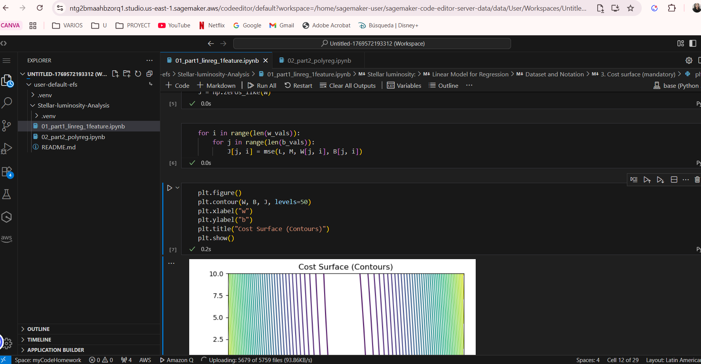
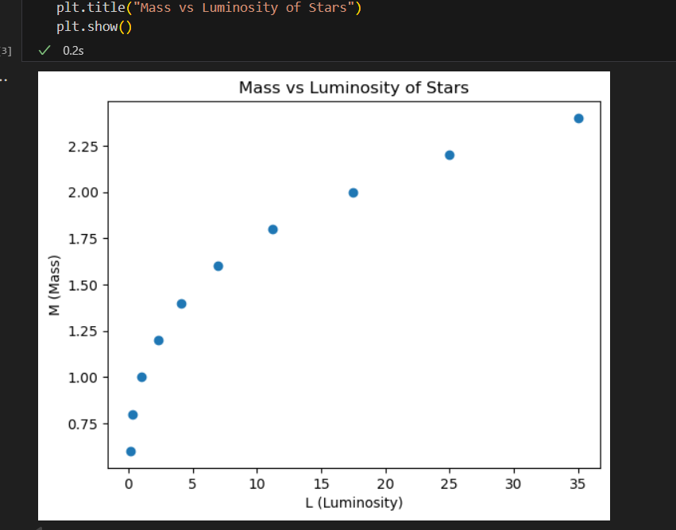
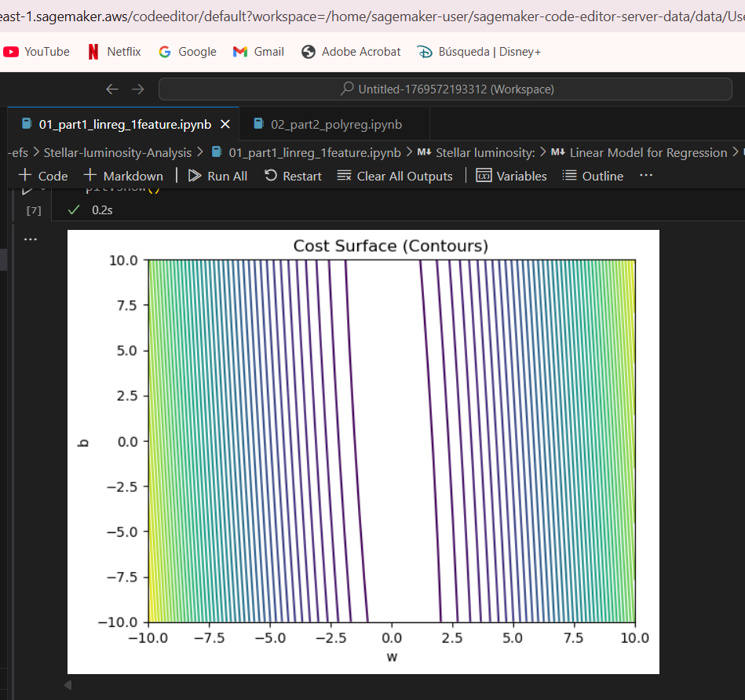
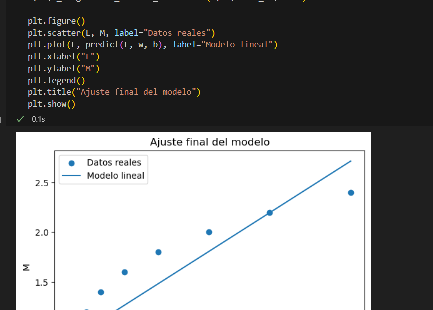
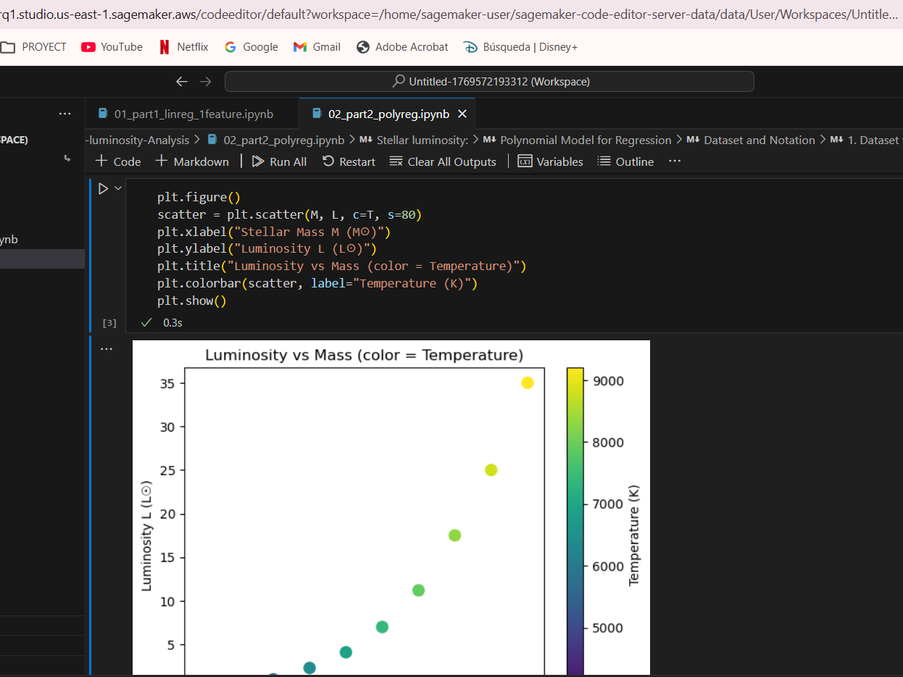
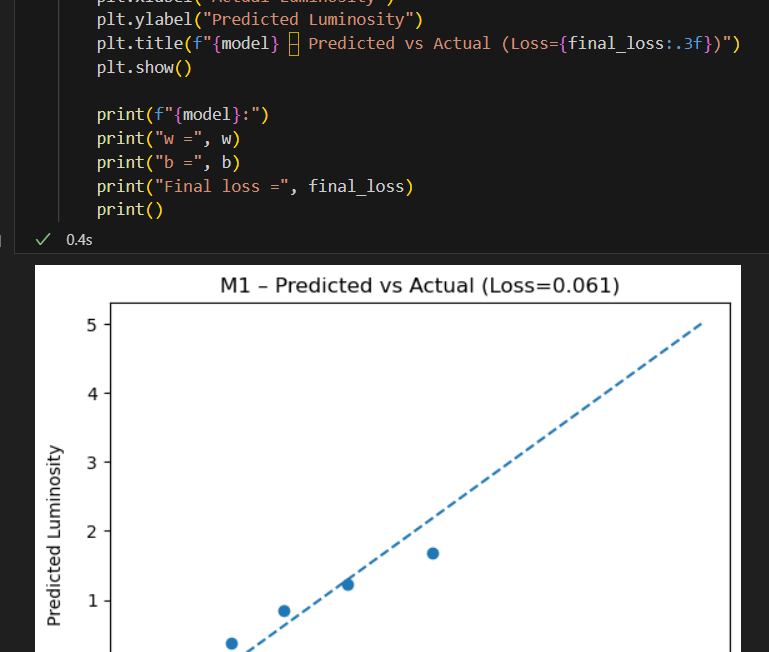
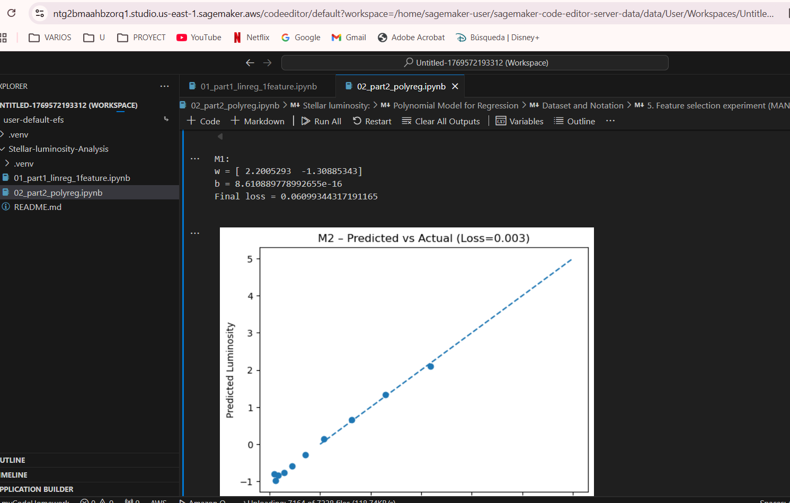

# Stellar Luminosity:

# Linear and Polynomial Models for Regression

## 🧑‍💻 Author

**Nicole Dayan Calderón**

- **Program**: Systems Engineering
- **University**: Escuela Colombiana de Ingeniería Julio Garavito
- **Course**: Digital Transformation and Business Solutions

---

## 🌟 Project Overview

The **Stellar Luminosity: Linear and Polynomial Models for Regression** project delves into the fascinating relationship between stellar features and their luminosity. By leveraging regression techniques, this analysis aims to model and predict stellar brightness, providing insights into the underlying astrophysical phenomena.

### Objectives

- **Understand Stellar Luminosity**: Explore how stellar features influence their brightness.
- **Apply Regression Techniques**: Implement linear and polynomial regression models to analyze and predict luminosity.
- **Enhance Predictive Accuracy**: Compare the performance of linear and polynomial models to identify the best fit for the data.

---

## 📂 Project Structure

### 1. Linear Regression with One Feature

- **Notebook**: `01_part1_linreg_1feature.ipynb`
- **Description**: This notebook introduces a simple linear regression model to predict stellar luminosity using a single feature. Key steps include:
  - Data preprocessing and visualization.
  - Training a linear regression model.
  - Evaluating model performance with metrics and plots.

### 2. Polynomial Regression

- **Notebook**: `02_part2_polyreg.ipynb`
- **Description**: This notebook extends the analysis by implementing polynomial regression to capture non-linear relationships. Key highlights include:
  - Feature engineering for polynomial terms.
  - Training and optimizing the polynomial regression model.
  - Visualizing the improved fit and comparing results with the linear model.

---

## 🚀 AWS SageMaker Execution Evidence

To execute the notebooks on AWS SageMaker, follow these steps:

1. Create a folder named `default` in your SageMaker environment.
2. Upload the repository folder into the `default` folder.

This setup ensures that the notebooks and their dependencies are correctly organized for execution in the SageMaker environment.

### Observations: Local vs SageMaker Execution

- **Local Execution**: Provides flexibility for quick iterations and debugging. However, it is limited by the computational resources of your local machine.
- **SageMaker Execution**: Offers scalable cloud-based resources, enabling faster training and execution for larger datasets or more complex models. Additionally, SageMaker provides integrated tools for monitoring and logging, which enhance the analysis process.

Include the following evidence:

- Performance metrics.
- Notebooks in Sagemaker.
- Visualizations generated during the execution.










---

## 🛠️ How to Use

1. **Clone the Repository**:
   ```bash
   git clone https://github.com/NicoleC09/Stellar-luminosity-Analysis.git
   ```
2. **Set Up the Environment**:
   - Ensure Python and Jupyter are installed.
   - Install required libraries:
     ```bash
     pip install -r requirements.txt
     ```
3. **Run the Notebooks**:
   - Open the notebooks in Jupyter or VS Code.
   - Follow the steps in each notebook to preprocess the data, train the models, and evaluate their performance.

---

## 📊 Key Insights

- **Linear Regression**: Provides a baseline model for understanding the relationship between a single feature and luminosity.
- **Polynomial Regression**: Captures non-linear patterns, offering a more accurate representation of the data.
- **Comparison**: Highlights the trade-offs between model simplicity and predictive power.

---

## 📜 License

This project is for educational purposes and is not licensed for commercial use.

---

## 🌌 Acknowledgments

- **Instructor**: For guidance and support throughout the course.
- **University**: Escuela Colombiana de Ingeniería Julio Garavito for providing the platform to explore and learn.
- **Tools**: Python, Jupyter, and AWS SageMaker for enabling efficient analysis and execution.
